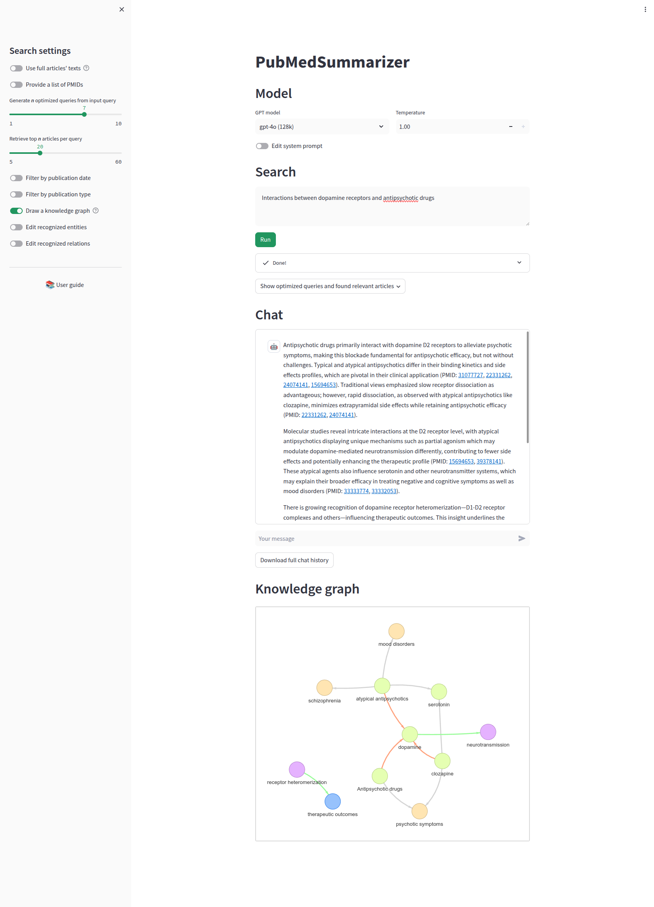

# PubMedSummarizer

**PubMedSummarizer** is a biomedical literature assistant that searches PubMed, retrieves abstracts or full articles, and generates summaries in response to user questions using OpenAI's GPT models. It includes both CLI and Streamlit-based interactive modes, and supports advanced retrieval options and custom prompts.

Originally built with GPT-3.5, the app now supports **GPT-4o** and demonstrates an early, custom implementation of Retrieval-Augmented Generation (RAG) — without relying on frameworks like LangChain.

## ✨ Key Features

- **Smart PubMed Querying**: Enter a natural language question, and the system will auto-generate optimized PubMed search queries using GPT.
- **Custom PMIDs Support**: You can skip the search and directly provide a list of PMIDs to analyze.
- **Abstract & Full-Text Retrieval**:
  - Fetches abstracts by default.
  - Optionally retrieves full articles from **PubMed Central (PMC)** or other public sources if available.
- **Semantic Chunk-Based Retrieval**: When full texts are used, the system performs sentence-level chunking and semantic search to extract the most relevant information for summarization.
- **Configurable Prompt Templates**: Modify prompt structure directly from the Streamlit UI.
- **Knowledge Graph Generation**: Automatically builds a simple knowledge graph of concepts and relations found in the retrieved documents.
- **Detailed Output**: The final summary includes in-text citations with PMIDs and highlights where each piece of information came from.
- **Multiple Search Parameters**: Fine-tune the PubMed query logic and context selection for each run.
- **Streamlit + CLI Support**: Interact via a user-friendly web interface or command-line.

> 💬 This project was created before GPT function calling and agents were available, using a fully custom RAG setup.

## 🛠️ Tech Stack

- Python
- Streamlit
- OpenAI API (GPT-3.5 / GPT-4o)
- SentenceTransformers for embedding and semantic retrieval
- Entrez / PubMed API
- Custom logic for knowledge graph and context extraction

## 🚀 Quickstart
1. Save your OpenAI key to `.env`:
```bash
OPENAI_API_KEY=sk-your-api-key
```
2. Build and start docker:
```bash
docker compose up --build
```
3. View the app at `http://0.0.0.0:8505/`

## 🧪 Examples (with GPT 3.5)
### AI applications in medicine
#### Input
`python PubMedSummarizer.py "AI applications in medicine"`
#### Optimized query
`"Artificial Intelligence AND Medicine"`
#### Abstracts fetched from PubMed
[here](example/abstracts.txt)
#### Relevant articles
`33811123 31939856 32250084 33509373`
#### Context chunks from articles
[here](example/context_chunks.txt)
#### Output

"Artificial intelligence (AI) is revolutionizing cancer research and personalized clinical care by leveraging high-dimensional datasets and innovative deep learning architectures. This advancement in AI has led to applications in detecting and classifying cancer, molecular characterization of tumors, drug discovery, repurposing, and predicting treatment outcomes (PMID: 33811123). The field of anesthesiology stands to benefit from AI through applications in perioperative and intensive care, pain management, and drug delivery and discovery. AI technologies have the potential to augment clinical judgment and skills, improving clinical endpoints like depth of anesthesia (PMID: 31939856).

Moreover, in forensic medicine, the integration of AI technology has shown feasibility in various identification tasks such as face recognition, DNA analysis, postmortem interval estimation, and injury identification. This approach not only brings new vitality to forensic medicine but also poses new challenges that need to be addressed for the collaborative development of "artificial intelligence plus forensic medicine" in the era of big data (PMID: 32250084).

In nuclear medicine imaging, AI and machine learning approaches are increasingly utilized for automated image reading, correlation with clinical outcomes, and technological applications in image processing. These methods aid in tumor imaging, quantification of tumor volume, segmentation, and classification of pathological foci, ultimately improving clinical decision-making and patient prognosis (PMID: 33509373).
Overall, the integration of AI in medicine showcases promising advancements in cancer research, anesthesiology, forensic medicine, and nuclear medicine imaging, indicating a transformative shift towards more efficient, precise, and personalized healthcare practices."

### digital mental health interventions
#### Input
`python PubMedSummarizer.py "digital mental health interventions"`
#### Intermediate steps
[here](example/mental_health.txt)
#### Output
"Digital mental health interventions, including those delivered via the web and apps, have shown promise in improving access to mental health treatment for various populations, such as college students and caregivers of older adults (PMID: 31333198, 32411643). These interventions have been effective in addressing common mental health issues like depression, anxiety, stress, and improving psychological well-being (PMID: 31333198, 37001253). The use of digital tools, such as cognitive behavioral therapy delivered online, has demonstrated positive outcomes in reducing symptoms and improving satisfaction with life (PMID: 37001253).

Additionally, the effectiveness of digital mental health interventions for adolescents and young people has been explored, showing potential in addressing mental health disorders early in life and reaching underserved clinical populations (PMID: 33913817). Computerized cognitive behavioral therapy has been effective in managing anxiety and depression in this population, emphasizing the importance of interventions with an in-person element or professional involvement for greater effectiveness (PMID: 33913817).

While digital mental health interventions offer benefits such as increased accessibility, reduced stigma, and improved user engagement, there are also challenges to address, including concerns about privacy, developer credibility, and the need for more rigorous studies to confirm their effectiveness and cost-effectiveness, especially in low-resource settings (PMID: 31333198, 35612165, 33913817). Continued research and development in this field are necessary to optimize the user experience, assess the long-term effectiveness, and ensure sustainable implementation of digital mental health interventions across diverse populations (PMID: 31333198, 35612165, 33913817)."


## App screenshot with knowledge graph

